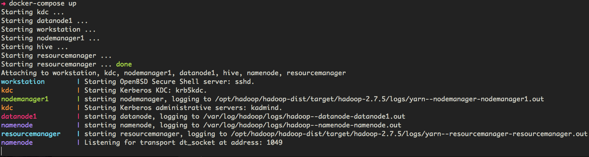

# Hadoop Development Cluster
A modern development environment for debugging, testing and patching components in the Hadoop ecosystem.



## Requirements
- Docker v17.12.0 or greater (with OSX Docker VM configured to at least 5GB RAM)
- OSX 10.13.3 or Linux

## Setup
Update your hosts file so the web ui links work for the rm, nm and spark:
```
#/etc/hosts

127.0.0.1       namenode
127.0.0.1       namenode.hadoop
127.0.0.1       httpfs1
127.0.0.1       httpfs1.hadoop
127.0.0.1       nodemanager1
127.0.0.1       nodemanager1.hadoop
127.0.0.1       resourcemanager
127.0.0.1       resourcemanager.hadoop
127.0.0.1       spark
127.0.0.1       spark.hadoop
```

## Create a docker bridge network
```
$ docker network create -d bridge hadoop
```

## Create an .env file
Please refer to the structure by viewing the `.env-example`. These variables will be used in the docker-compose file.

## Building the images
Go to the repo base directory and run:
```
$ dev-support/docker-compose/scripts/docker-build.sh
```

## Starting the cluster
Now go to the docker-compose directory and run:
```
$ export HADOOP_COMPOSE_DIR=`pwd`
$ export FORMAT_NAMENODE=false
$ docker-compose up --force-recreate
```

## Stopping the cluster
```
$ docker-compose down

```

## Running jobs
```
$ docker exec -it spark bash
```
Check kerberos ticket (optional):
```
$ klist
```
Test HDFS:
```
$ echo abc123 > testfile
$ hdfs dfs -ls /
$ hdfs dfs -put testfile /
$ hdfs dfs -cat /testfile
```
Test YARN:
```
$ yarn jar \
  /opt/hadoop/hadoop-mapreduce-project/hadoop-mapreduce-examples/target/hadoop-mapreduce-examples-2.7.4.jar \
  pi 10 100
```
Test HIVE:
```
$ hive
CREATE DATABASE IF NOT EXISTS hivetest;
CREATE TABLE hivetest.students (name VARCHAR(64), age INT, gpa DECIMAL(3, 2)) CLUSTERED BY (age) INTO 2 BUCKETS STORED AS ORC;
INSERT INTO TABLE hivetest.students VALUES ('fred flintstone', 35, 1.28), ('barney rubble', 32, 2.32);
SELECT * FROM hivetest.students;
```
Test SPARK (check NM logs on web ui for result):
```
$ /opt/spark/bin/spark-submit \
  --class org.apache.spark.examples.SparkPi \
  --master yarn \
  --deploy-mode cluster \
  --executor-memory 512m \
  --num-executors 1 \
  /opt/spark/examples/target/original-spark-examples_2.11-2.3.0-SNAPSHOT.jar \
  1
```
Test HTTPFS
```
$ curl -sS 'http://httpfs1.hadoop:14000/webhdfs/v1?op=gethomedirectory&user.name=root'
```
